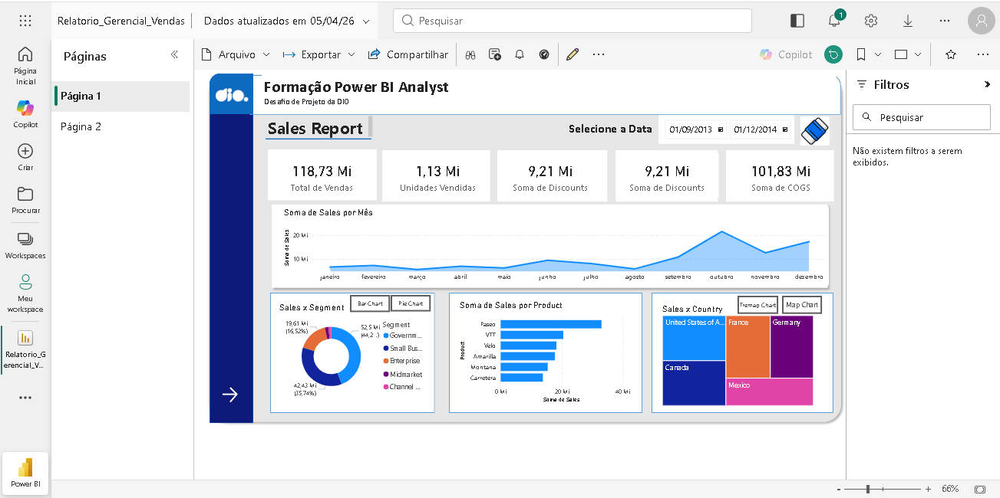

# Relatório Gerencial de Vendas - Power BI

## 📌 Visão Geral
Este projeto consiste no desenvolvimento de um relatório gerencial elaborado no Power BI, utilizando a base de dados **Sample Financials**. O objetivo principal foi aplicar recursos avançados de navegação e design para criar uma experiência de análise fluida e profissional.

## 🛠️ Recursos Implementados

### 1. Design e Layout
* **Estrutura Visual:** Organização do layout utilizando objetos para delimitar áreas de filtros, KPIs e gráficos.
* **Segmentadores de Dados:** Filtros interativos para refinar a análise por diferentes dimensões.
* **Ícones Associados:** Uso de botões com imagens para tornar a segmentação de dados mais intuitiva e visual.

### 2. Navegabilidade e UX
* **Menu de Navegação:** Botões configurados para alternar entre as páginas do relatório de forma ágil.
* **Uso de Indicadores (Bookmarks):** Implementação de indicadores e botões para alternar visuais sobre o mesmo assunto em um único espaço, otimizando a visualização.

## 📄 Estrutura do Relatório
O projeto está dividido em duas páginas estratégicas:
* **Página 1 (Home/Vendas):** Foco em métricas de alto nível e navegação principal.
* **Página 2 (Detalhamento):** Análise expandida dos dados financeiros conforme requisitos do desafio.

## 🌐 Publicação e Acesso
O relatório foi publicado no **Power BI Service**, permitindo o consumo dos dados via web.

> **Visualizar Projeto:** [Inserir Link do Power BI Service Aqui]

---

## 📸 Demonstração

| Dashboard Principal | Detalhamento |
| :---: | :---: |
|  |  |

---

## 📂 Arquivos do Repositório
* `Relatorio_Gerencial_Vendas.pbix`: Arquivo fonte do Power BI.
* `/Imagens`: Screenshots do dashboard para visualização rápida.

---
**Desenvolvido por Diego Zares**
